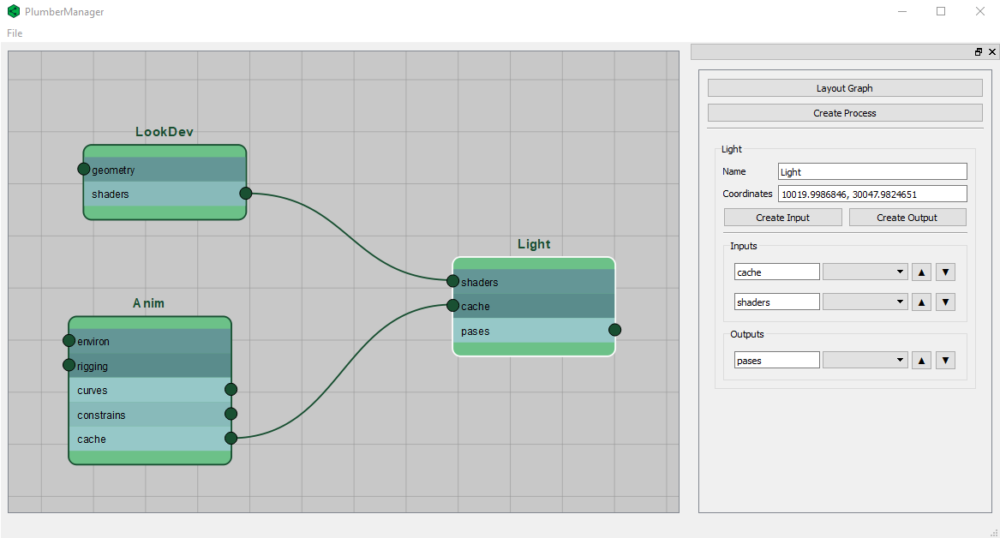

# PlumberManager
A helper tool to design CG Pipeline interactive diagramas and data flow documentation



## Requirements:
- Python
- PyQt5 or PySide2
- [qdarkstyle](https://github.com/ColinDuquesnoy/QDarkStyleSheet)
- [Qt.py](https://github.com/mottosso/Qt.py)
- [Nodz (modified version)](https://github.com/hasielhassan/Nodz)
- [pygraphviz](https://github.com/pygraphviz/pygraphviz)

## Setup and run

Install the dependencies on the `requirements.txt` file
```
python -m pip install requirements.txt
```

To start PlumberManager just run the `manager.py` script

```
python manager.py
```

## Roadmap

- [ ] Allow to update connection names on existing nodes
- [ ] Allow to update connection data types on existing nodes
- [ ] Display the data type icons on the node slot names
- [ ] Option to preview isolated view of a selected node and just its direct connections
- [x] Save relative icons paths on graph files
- [ ] Fix properties panel to not display duplicated widgets after selection
- [ ] Improve connections ordering functionality
- [ ] Allow for process and input/output descriptions, with support for markdown
- [ ] Add export documentation functionality, that expots an html or makrdown document with all processes and its inoput and outputs
